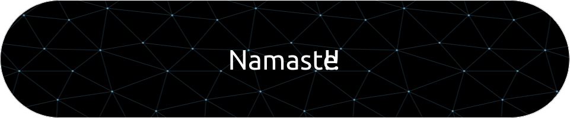

<h1 align="center">Hi 👋, I'm Vinayak Singhal</h1>
<h3 align="center">Aspiring Software developer</h3>

  

- 🌱 I’m currently learning **React.js**

- 📫 How to reach me **vinayaksrock@gmail.com**

<h3 align="left">Connect with me:</h3>

<h3 align="left">Languages and Tools:</h3>

          

<!---
imvinayak32/imvinayak32 is a ✨ special ✨ repository because its `README.md` (this file) appears on your GitHub profile.
You can click the Preview link to take a look at your changes.
--->
